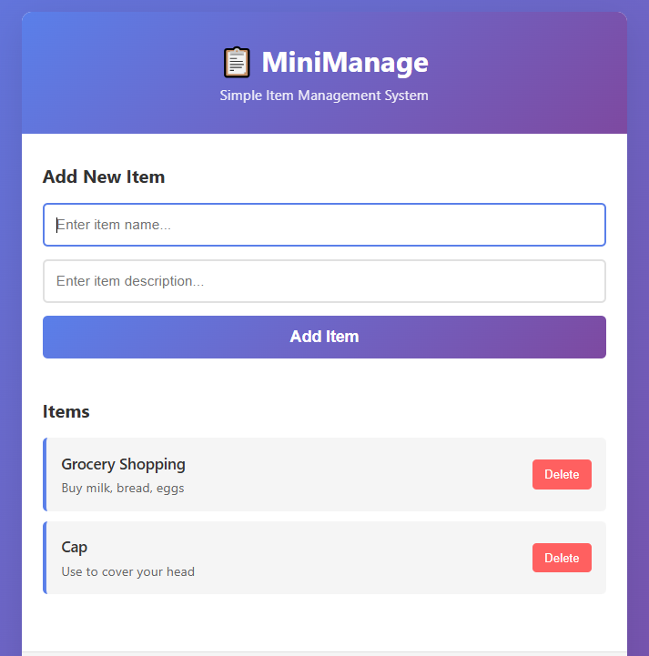

# MiniManage - Management System with Docker

A lightweight, simple containerized item management system with frontend, backend, and database services.

---

## Demo



---

## System Architecture

```
┌─────────────────────────────────────────────────┐
│              MiniManage System                  │
├─────────────────────────────────────────────────┤
│                                                 │
│  Frontend (Nginx)     Backend (Node.js)  DB    │
│  Port 80              Port 5000        SQLite  │
│  ├─ HTML/CSS/JS       ├─ Express API   │      │
│  ├─ Interactive UI    ├─ RESTful Routes│      │
│  └─ CORS enabled      └─ SQLite3       │      │
│                                                 │
└─────────────────────────────────────────────────┘
```

## Features

- **Simple Frontend**: Clean, responsive UI for managing items
- **Express Backend**: RESTful API with validation
- **SQLite Database**: Lightweight, persistent storage
- **Docker Compose**: Easy deployment with 3 services
- **CORS Enabled**: Frontend-backend communication
- **Health Check**: Built-in health endpoint

## Prerequisites

- Docker installed ([Get Docker](https://www.docker.com/get-started))
- Docker Compose installed (included with Docker Desktop)
- Git (optional)

## Project Structure

```
MiniManage/
├── docker-compose.yml          # Docker services configuration
├── README.md                   # This file
├── frontend/
│   ├── Dockerfile              # Nginx container
│   ├── index.html              # Main UI
│   ├── style.css               # Styling
│   ├── script.js               # Frontend logic
│   └── nginx.conf              # Nginx config
├── backend/
│   ├── Dockerfile              # Node.js container
│   ├── package.json            # Node dependencies
│   ├── server.js               # Express app & API routes
│   └── .env.example            # Environment variables
└── db/
    └── (empty - SQLite DB created on first run)
```

## Quick Start

### 1. Clone or Extract the Project

```bash
cd MiniManage
```

### 2. Build and Run with Docker Compose

```bash
docker-compose up --build
```

This command will:
- Build the frontend Docker image
- Build the backend Docker image
- Pull the SQLite image
- Create and start all 3 containers
- Create a volume for persistent data

### 3. Access the Application

Open your browser and navigate to:

```
http://localhost
```

You should see the MiniManage interface. Start adding items!

## API Endpoints

The backend exposes the following RESTful endpoints:

### Health Check
```
GET /health
Response: { "status": "ok", "message": "Backend is running" }
```

### Get All Items
```
GET /api/items
Response: [
  {
    "id": 1,
    "name": "Item Name",
    "description": "Item Description",
    "created_at": "2025-01-01T12:00:00.000Z"
  }
]
```

### Get Single Item
```
GET /api/items/:id
```

### Add Item
```
POST /api/items
Request: {
  "name": "Item Name",
  "description": "Item Description (optional)"
}
Response: { "id": 1, "name": "...", "description": "..." }
```

### Update Item
```
PUT /api/items/:id
Request: {
  "name": "Updated Name",
  "description": "Updated Description"
}
```

### Delete Item
```
DELETE /api/items/:id
Response: { "message": "Item deleted successfully", "id": 1 }
```

## Commands

### Start Services
```bash
docker-compose up
```

### Start Services in Background
```bash
docker-compose up -d
```

### Stop Services
```bash
docker-compose down
```

### Stop and Remove All Data
```bash
docker-compose down -v
```

### View Logs
```bash
# All services
docker-compose logs

# Specific service
docker-compose logs backend
docker-compose logs frontend
```

### Rebuild Images
```bash
docker-compose up --build
```

### Run Services in Development Mode
```bash
docker-compose -f docker-compose.dev.yml up
# (Create docker-compose.dev.yml for development config)
```

## Configuration

### Environment Variables

**Backend (.env)**
- `PORT`: Server port (default: 5000)
- `DATABASE_PATH`: SQLite database path (default: /app/data/items.db)
- `NODE_ENV`: Environment (default: production)

### Volumes

- **db_data**: Persistent storage for SQLite database
  - Survives container restarts
  - Shared between backend and database service

## Troubleshooting

### Port Already in Use
If port 80 or 5000 is already in use, modify the ports in `docker-compose.yml`:

```yaml
frontend:
  ports:
    - "8080:80"  # Change 8080 to your preferred port

backend:
  ports:
    - "5001:5000"  # Change 5001 to your preferred port
```

### Cannot Connect to Backend
- Ensure all containers are running: `docker-compose ps`
- Check logs: `docker-compose logs backend`
- Verify the backend is accessible: `curl http://localhost:5000/health`

### Database Permission Issues
```bash
# Reset permissions and volumes
docker-compose down -v
docker-compose up --build
```

### Container Exits Immediately
```bash
# Check logs
docker-compose logs [service-name]
```

## Performance Notes

- **Lightweight**: ~150MB total image size
- **Fast Startup**: <5 seconds typical startup time
- **Low Memory**: ~200MB RAM when idle
- **SQLite**: Sufficient for small datasets (<10k items)

## Scaling Considerations

For larger deployments:
1. **Database**: Consider migrating to PostgreSQL/MySQL
2. **Backend**: Add load balancing with multiple instances
3. **Frontend**: Use a CDN for static assets
4. **Cache**: Add Redis for caching

## Development

### Modify Frontend
1. Edit files in `frontend/`
2. Restart the container: `docker-compose restart frontend`
3. Refresh browser

### Modify Backend
1. Edit files in `backend/`
2. Rebuild: `docker-compose up --build backend`
3. Refresh browser

### Add Dependencies
```bash
# Backend
docker-compose exec backend npm install <package>

# Rebuild to persist changes
docker-compose up --build backend
```

## Security Notes

This is a **demo/learning project**. For production:

- ✅ Add authentication (JWT, OAuth)
- ✅ Validate all inputs
- ✅ Use HTTPS
- ✅ Add rate limiting
- ✅ Implement proper error handling
- ✅ Use environment-specific configurations
- ✅ Add database backups
- ✅ Implement CSRF protection
- ✅ Use secrets management (not .env)

## License

MIT License - Feel free to use and modify.

## Support

For issues or questions:
1. Check logs: `docker-compose logs`
2. Verify Docker installation: `docker --version`
3. Ensure ports are available: Check with `netstat` (Windows) or `lsof` (Mac/Linux)

---

**Happy Managing!** 🎉
